# Planet Sudo

## Installation via IntelliJ IDE

### Intellij installieren

- IntelliJ **Community Edition** (nicht die Ultimate Edition!) [herunterladen](https://www.jetbrains.com/idea/download/) und installieren.  
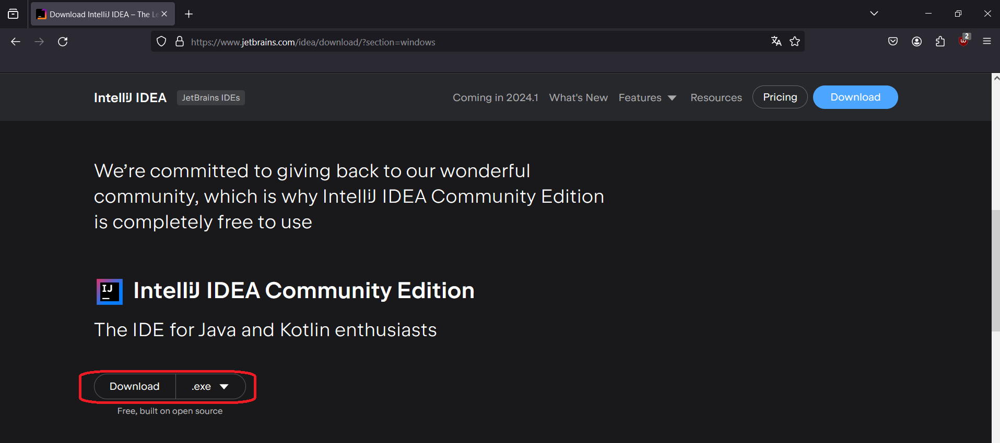  
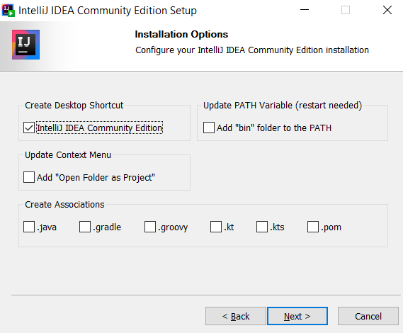  

### Git installieren

- In IntelliJ auf `Get from VSC` klicken, dann auf `Repository URL`.
- Version control auf `Git` einstellen.
- Sollte die Fehlermeldung `Git is not installed` auftauchen auf `Download and Install` klicken.  
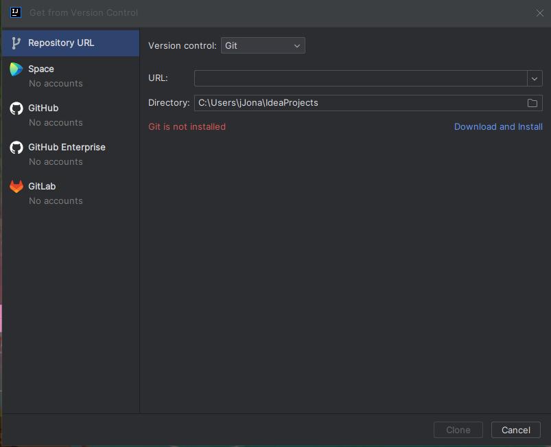  
    
### Planet Sudo installieren

- In IntelliJ im selben Fenster die URL `https://github.com/openbase/planetsudo` einfügen und auf `Clone` klicken.
- Sollte die Fehlermeldung `JDK "17" is missing` auftreten auf `Configure...` --> `Download JDK` gehen und dann `Eclipse Temurin` auswählen und installieren.  
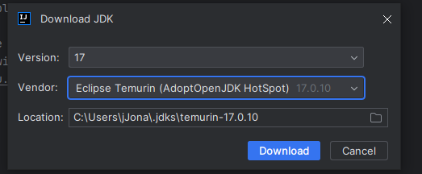  

- Die Datei `src/main/kotlin/org.openbase.planetsudo/main/PlanetSudo.kt` öffnen (Doppelklick).
- Jetzt kann PlanetSudo gestartet werden. Dazu einen Rechtsklick auf `Planet Sudo` und dann auf `Run 'Planet Sudo'`   
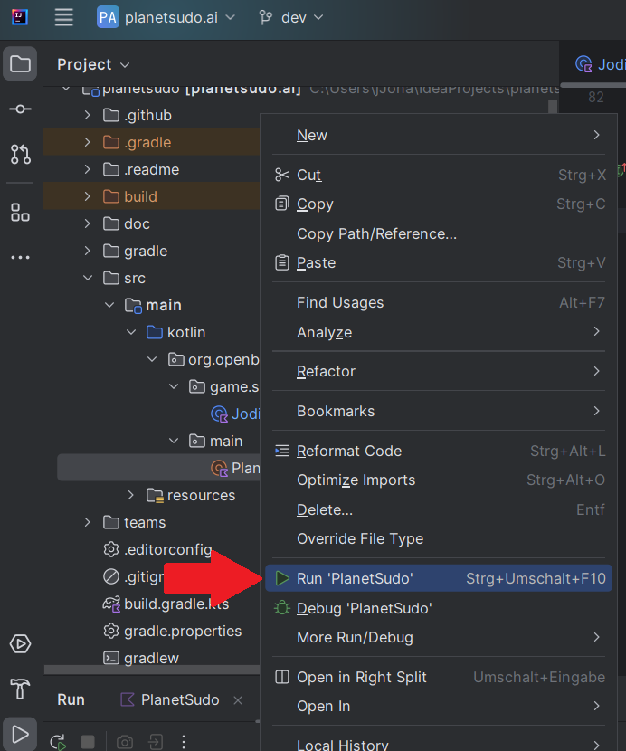  

- Nun muss in IntelliJ der Server eingestellt werden. Dazu oben rechts auf `PlanetSudo` klicken dort auf `Edit Configuration` und dann unter `Programm arguments: --server elaine` eingeben. Dann das ganze mit `Apply` bestätigen.  
  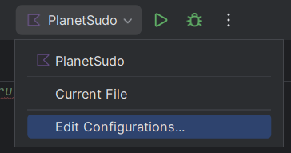  
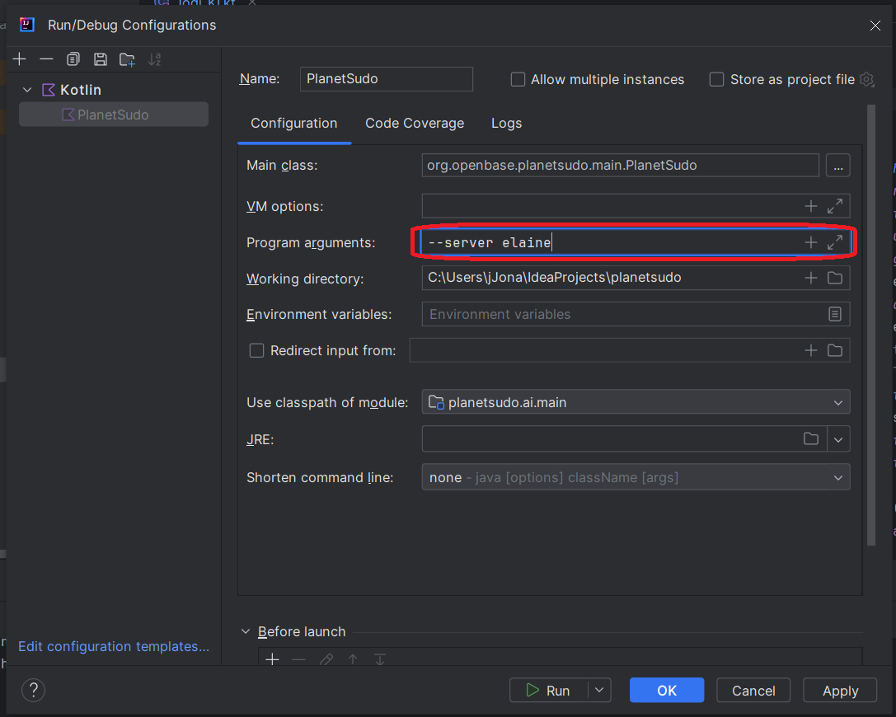  

- Als Nächstes muss die Dokumentation heruntergeladen werden. Dazu in IntelliJ rechts an der Seite das Gradle-Menü öffnen und auf `Download Sources` klicken.  
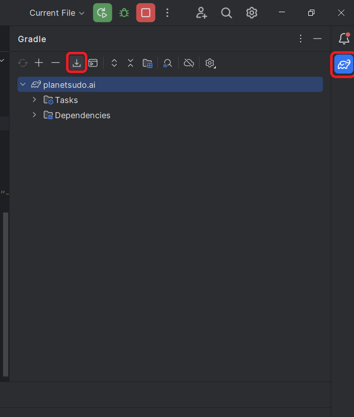  

## Anlegen einer neuen KI

- In IntelliJ zur Klasse "DefaultStrategy.kt" navigieren (`src/main/kotlin/org/openbase/planetsudo/game/strategy`) und hier die `DefaultStrategy.kt` mit einem Rechtsklick auf die Klasse (`Refactor` --> `Rename`) umbenennen.  
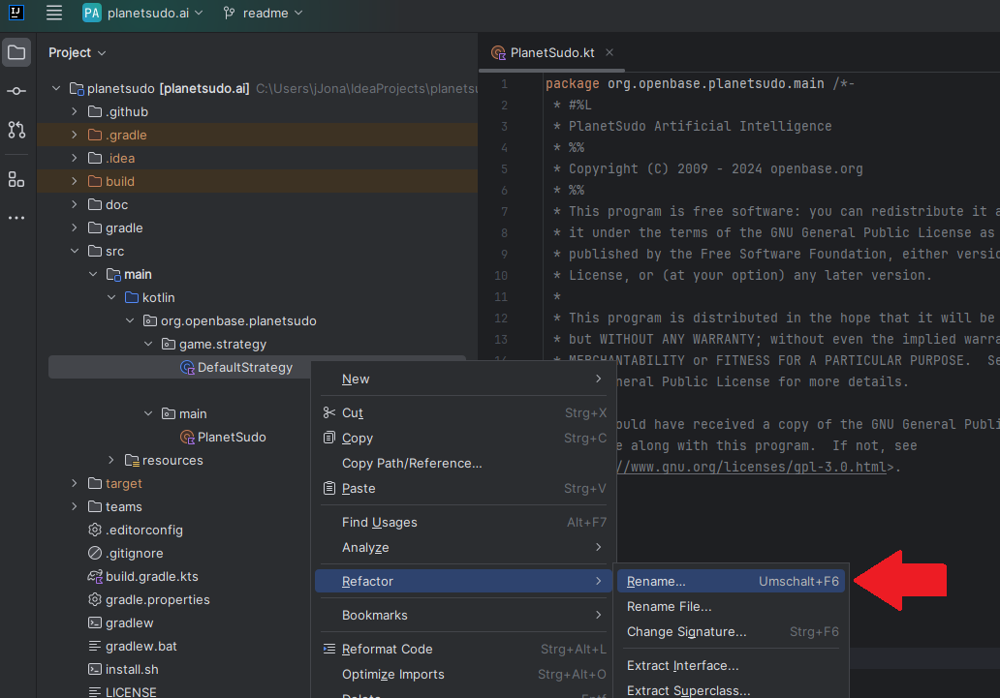  
- Die neue Strategieklasse kann nun erweitert werden.
- Informationen über mögliche Funktionalitäten könnt ihr über die Methoden Dokumentation herausfinden.
- Dazu in der Strategie `agent.` schreiben und dann Strg + Leertaste drücken.
- Nun kann mann alle möglichen Funktionen sehen. Um die Dokumentation zu diesen Anzuzeigen, geht man auf die drei Punkte und dort auf `Code Completion Settings`.  
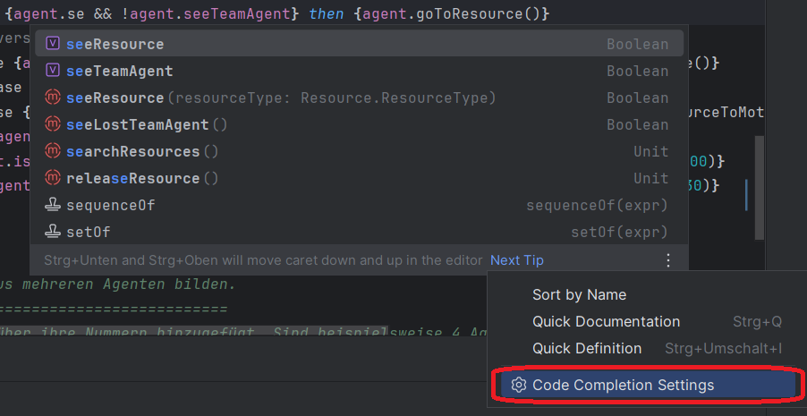  
- Dort aktiviert man `Show the documentation popup in X ms` und stellt die Zeit nach Belieben ein (z.B. 10 ms).  
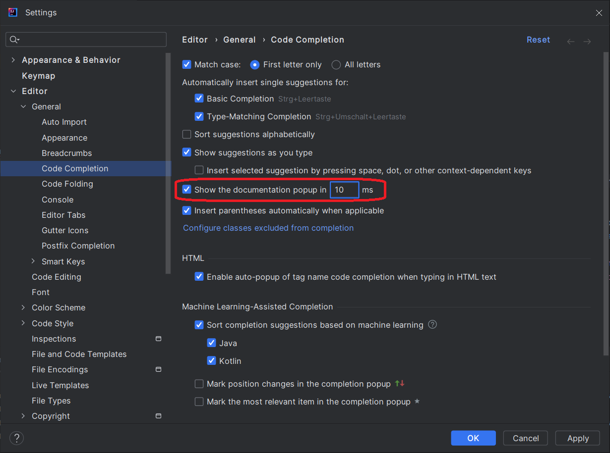

## Anlegen eines neuen Teams

- Sofern ihr zuvor eine neue Strategieklasse angelegt habt, bitte zunächst PlanetSudo beenden und anschließen neu starten. 
- Anschließend in PlanetSudo unter `Einstellungen` auf `Team erstellen` klicken.
- Wichtig ist hierbei, dass eine gültige Strategie angegeben wird. Hier erfolgt die Eingabe des Namens der zuvor erstellten Strategieklasse. Der Dateityp (".kt") wird hierbei nicht benötigt.  
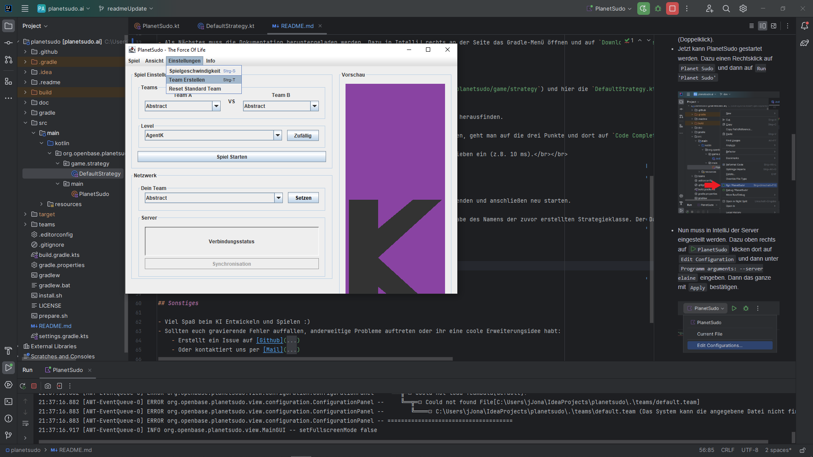  
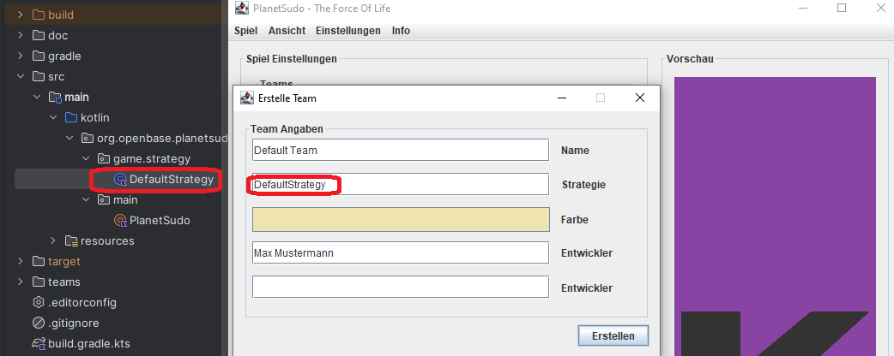  

## Mit dem Server synchronisieren

- In Planet Sudo kann über den Synchronisations-Button die Synchronisation erfolgen.
- Ist das Statusfeld Blau, ist der Transfer erfolgreich gewesen.

## Sonstiges

- Viel Spaß beim KI Entwickeln und Spielen :)
- Sollten euch gravierende Fehler auffallen, anderweitige Probleme auftreten oder ihr eine coole Erweiterungsidee habt:
    - Erstellt ein Issue auf [Github](https://github.com/openbase/planetsudo/issues/new)
    - Oder kontaktiert uns per [Mail](mailto:support@openbase.org)

Copyright (C) 2009 - 2024 [openbase.org](http://www.openbase.org)
